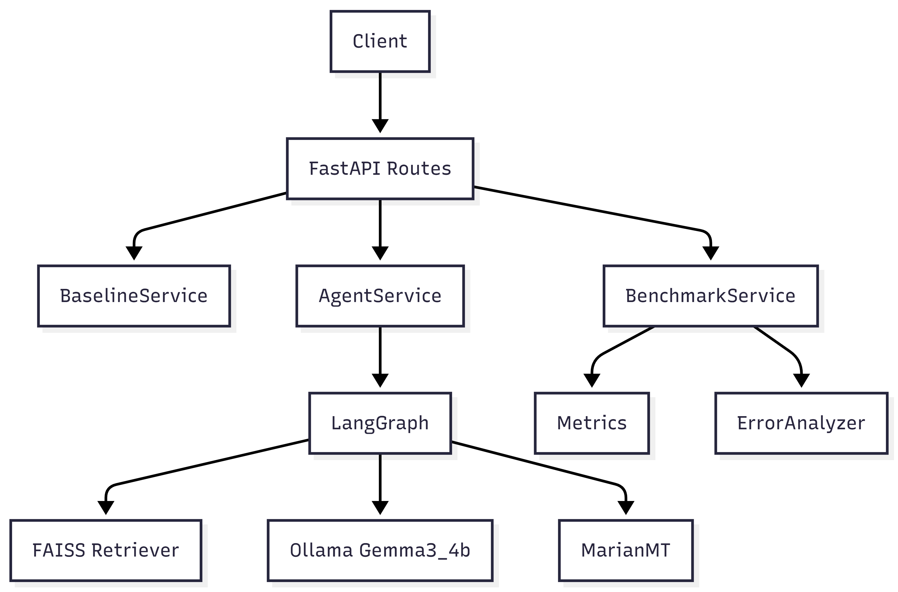
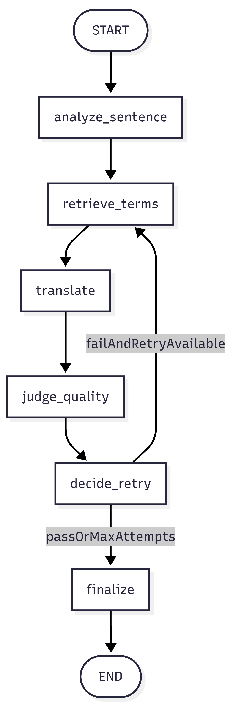
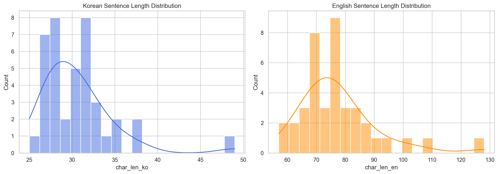
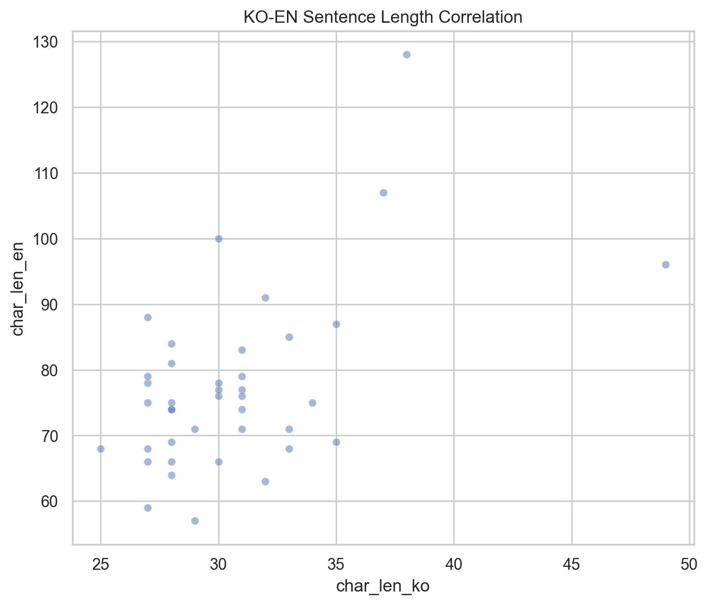
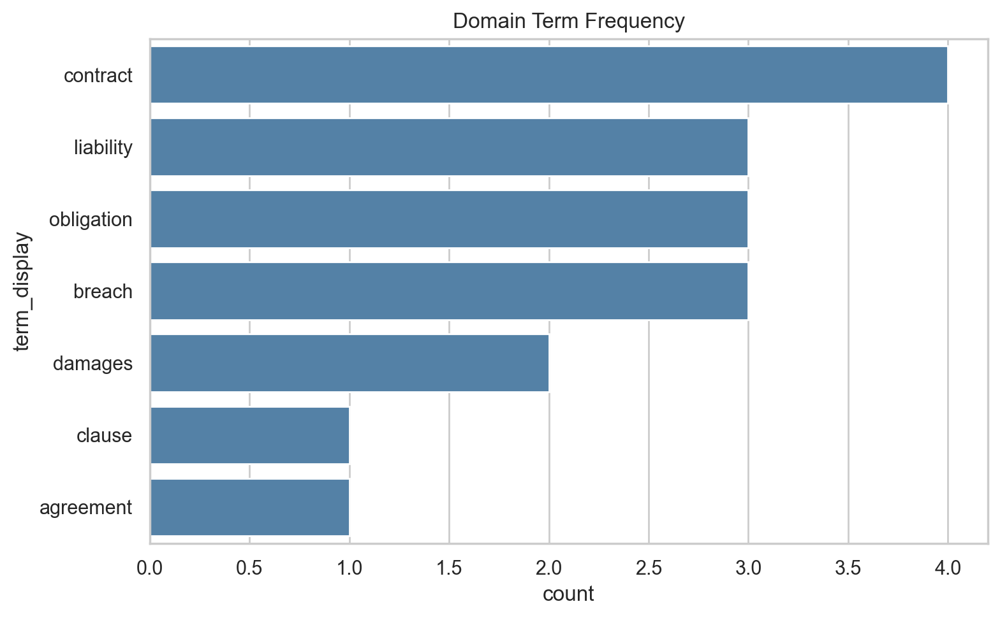
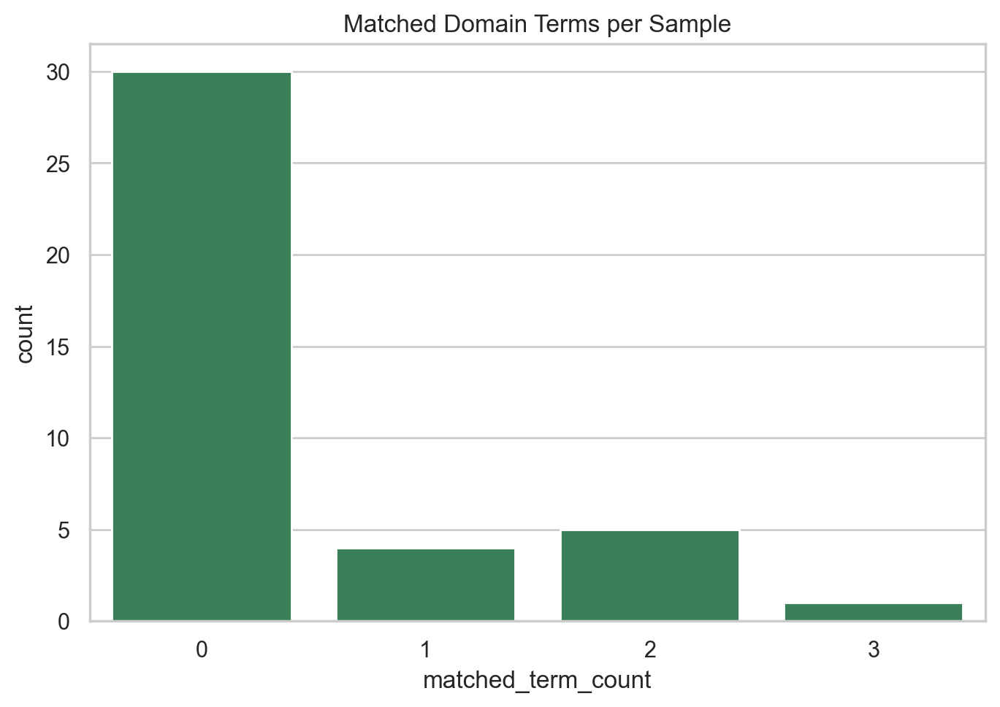
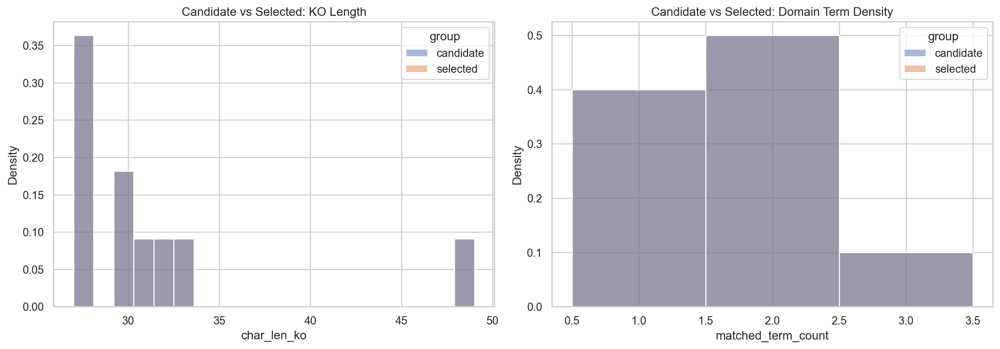
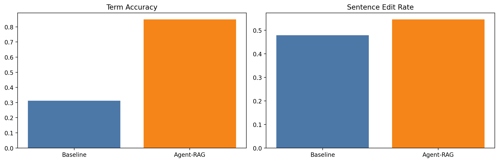
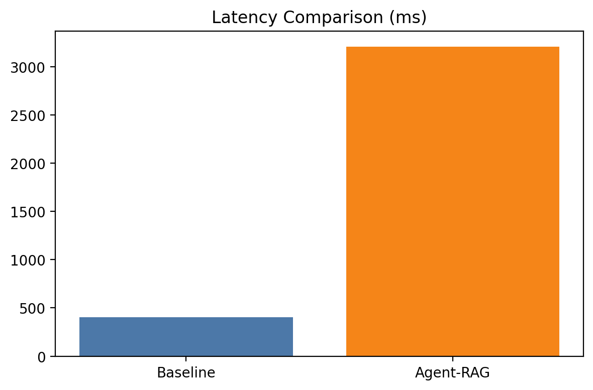

# Agentic Translation QA 결과 리포트

## 1. 시스템 아키텍처 및 Agent 워크플로우

### 시스템 아키텍처



- API 계층은 번역/벤치마크 요청의 진입점을 제공하고, 서비스 계층은 실행 책임을 분리한다.
- Agent 경로는 LangGraph 상태 전이를 기반으로 RAG 검색, 번역 생성, 품질 판정을 반복한다.

### Agent 워크플로우



- 종료 조건: quality_pass == true 또는 attempt_count >= max_attempts
- 재시도 조건: 품질 미달이면서 재시도 가능

## 2. 프레임워크/모델 선정

### 실험 환경

- OS: Windows11
- CPU: 12th Gen Intel(R) Core(TM) i5-12400F
- RAM: 32GB
- GPU: NVIDIA GeForce RTX 3060
- 실행 환경: 로컬 단일 PC, uv 기반 Python 3.14.4 런타임
- 추론 형태: MarianMT + Ollama(gemma3:4b) + FAISS를 동일 장비에서 end-to-end 실행

### 프레임워크/모델 선정 이유

- FastAPI: 경량 API 구현/테스트에 적합, 스키마 기반 문서화 용이
- LangGraph: 노드/상태 기반으로 Agent 루프를 명시적으로 구현 가능
- MarianMT(Helsinki-NLP/opus-mt-ko-en): 로컬 실행 가능, baseline 구축 용이
- Gemma(gemma3:4b): 로컬 LLM 추론 가능, 구조화 프롬프트 기반 판정 가능
- MiniLM 임베딩 + FAISS: CPU 중심 환경에서도 빠른 벡터 검색 가능

## 3. 데이터셋 EDA 결과



- 한/영 길이 분포가 단봉형으로 모이고 극단치가 소수(ko max=49, en max=128)라, 특정 초장문에 편향되지 않은 평가셋으로 해석된다.



- 한국어 길이가 증가할수록 영어 길이도 함께 증가하는 양의 상관 구조가 확인되어, 병렬 정합성이 전반적으로 유지된 것으로 해석된다.



- 상위 용어가 법률 도메인에 상대적으로 집중(contract, liability, obligation, breach)되어, 도메인별 난이도 균등성보다는 "용어 정확도 검증" 목적에 더 최적화된 셋으로 해석된다.



- 문장당 핵심 용어 수가 저~중밀도 구간에 주로 분포해, 과도한 multi-term 문장보다 실무형 단문/중문 번역 검증에 적합하다.



- 선택셋이 후보군 대비 길이비(en/ko)와 용어밀도 분포를 크게 훼손하지 않아, 샘플링으로 인한 분포 왜곡은 제한적이라고 해석된다.

## 4. Baseline vs Agent-RAG 비교

| 지표 | Baseline | Agent-RAG | Delta | 해석 |
| --- | --- | --- | --- | --- |
| Term Accuracy | 0.3125 | 0.85 | +0.5375 | 용어 일치율은 크게 개선 |
| Sentence Edit Rate | 0.4785 | 0.5461 | +0.0676 | 문장 품질(참조대비)은 악화 |
| Avg Latency (ms) | 403.55 | 3210.2 | +2806.65 | 지연 비용 큼 |
| Agent Judgment Accuracy | - | 0.375 | - | 판정 신뢰도 낮음 |

- Agent-RAG는 용어 보강에는 효과적이지만, 현재 구현에서는 문맥 품질 및 판정 정확도 저하가 동반된다.





- 품질 개선과 지연 오버헤드의 trade-off를 시각적으로 보여준다.

## 5. 오류 유형별 근본 원인 분석

### term_mistranslation

- 현상: Baseline 37건, Agent-RAG 10건
- 직접 원인: 번역 모델의 도메인 용어 매핑 미흡
- 구조 원인: 용어집 기반 강제 제약 없음
- 증거: error_analysis.baseline.term_mistranslation = 37, error_analysis.agent_rag.term_mistranslation = 10

### omission

- 현상: Baseline 1건, Agent-RAG 0건
- 직접 원인: baseline 출력 일부에서 핵심 정보 탈락
- 구조 원인: baseline은 용어/정보 보강 루프가 없어 누락 회복 불가
- 증거: error_analysis.baseline.omission = 1, error_analysis.agent_rag.omission = 0

### context_error

- 현상: Baseline 3건, Agent-RAG 30건
- 직접 원인: 번역 후 괄호 기반 용어 삽입이 문장 자연성을 저해
- 구조 원인: 후처리 정책이 의미/문체 품질보다 용어 포함을 우선
- 증거: error_analysis.agent_rag.context_error = 30, 실패 사례 3건 모두 context_error

### agent_misjudgment

- 현상: Agent-RAG 24건
- 직접 원인: judge 프롬프트가 용어 포함 여부에 편향
- 구조 원인: 판단 기준에 문맥 품질 패널티가 약함
- 증거: agent_judgment_accuracy = 0.375, error_analysis.agent_rag.agent_misjudgment = 24

### rag_retrieval_failure

- 현상: Baseline 0건, Agent-RAG 0건
- 해석: 본 실험에서는 검색 미반환 자체보다 검색 결과 활용 정책에서 품질 저하가 주로 발생

## 6. 현재 구조의 한계 및 개선 아이디어

### 한계

- 40건 기준으로 확장했지만, 단일 실행(run 1회) 결과라 반복 실험 기반 신뢰구간은 아직 부족
- judge가 용어 포함을 과신해 오판 가능성이 큼
- 후처리(괄호 삽입)가 문맥 품질을 훼손

### 개선안

- Phase 0: judge 스코어링 재설계
  - 문맥 왜곡/부자연 표현에 감점 규칙 추가
- Phase 1: 후처리 정책 제거 또는 조건부 적용
  - 용어 삽입은 번역문에 자연스럽게 통합되는 경우만 허용
- Phase 1: 도메인 제약 retrieval + rerank
  - 잘못된 도메인 용어 혼입 최소화
- Phase 2: 40샘플 전체 재실행 + 도메인별 분할 결과 보고
  - 의료/법률/기술별 편차 분석 강화
- Phase 2: LangSmith 기반 노드별 실패 패턴 분석
  - analyze/judge 구간의 오판 원인 추적 자동화

## 7. 벤치마크 및 평가 방식

### 번역 품질 평가

평가 지표:
- 용어 정확도(term_accuracy, %)
- 문장 단위 수정률(sentence_edit_rate)

결과(40샘플):
- Baseline: 용어 정확도 0.3125, 문장 수정률 0.4785
- Agent-RAG(Proposed): 용어 정확도 0.85, 문장 수정률 0.5461

해석:
- Agent-RAG는 용어 정확도는 크게 개선했지만, 문장 수정률은 악화되어 문맥 품질 trade-off가 발생했다.

### Agent 평가

평가 지표:
- Agent 재시도 횟수 분포(retry_distribution)
- Agent 품질 판단 정확도(agent_judgment_accuracy, 수동 검증 대비)

결과(40샘플):
- 재시도 분포: 0_retry=36, 1_retry=0, 2_retry=4
- 평균 재시도 횟수: 0.2
- 시도별 pass율: attempt_1=1.0, attempt_2=0.0, attempt_3=0.0
- Agent 품질 판단 정확도: 0.375

해석:
- 다수 샘플이 1회 시도에서 종료되지만, 판단 정확도(0.375)가 낮아 조기 종료 품질 신뢰도가 제한적이다.

### End-to-End 평가

평가 지표:
- 평균 응답 시간(ms): Baseline vs Proposed
- 오류 유형별 분류/빈도
- 성공/실패 사례 각 3건 이상 심화 분석

결과:
- 평균 응답 시간: Baseline 403.55ms vs Agent-RAG 3210.2ms (오버헤드 +2806.65ms)
- 오류 유형(빈도):
  - Baseline: term_mistranslation=37, omission=1, context_error=3, agent_misjudgment=0, rag_retrieval_failure=0
  - Agent-RAG: term_mistranslation=10, omission=0, context_error=30, agent_misjudgment=24, rag_retrieval_failure=0

- 심화 사례(각 3건):
  - 성공

```json
[
  {
    "sample_id": "l10",
    "source_text": "중대한 과실이 없는 한 손해배상 책임은 제한된다.",
    "reference": "Liability for damages is limited unless there is gross negligence.",
    "baseline_output": "As long as there is no serious error, the responsibility for damages is limited.",
    "agent_rag_output": "As long as there is no serious error, the responsibility for damages is limited. (gross negligence)",
    "improvement_reason": "lower_or_equal_edit_rate_with_agent_rag"
  },
  {
    "sample_id": "l2",
    "source_text": "계약 해지 시 위약금은 계약 금액의 20%로 한다.",
    "reference": "In case of contract termination, the penalty shall be 20% of the contract amount.",
    "baseline_output": "When you make a contract, you have 20 percent of the amount of money you make.",
    "agent_rag_output": "When you make a contract, you have 20 percent of the amount of money you make. (penalty) (contract termination)",
    "improvement_reason": "lower_or_equal_edit_rate_with_agent_rag"
  },
  {
    "sample_id": "t12",
    "source_text": "부하 분산 계층을 추가해 시스템 가용성을 개선했다.",
    "reference": "System availability was improved by adding a load balancing layer.",
    "baseline_output": "Adding load-sharing classes has improved the availability of the system.",
    "agent_rag_output": "Adding load-sharing classes has improved the availability of the system. (load balancing)",
    "improvement_reason": "lower_or_equal_edit_rate_with_agent_rag"
  }
]
```

  - 실패: m4, t6, l13

```json
[
  {
    "sample_id": "m4",
    "source_text": "만성 질환 환자는 정기적인 진단과 치료 계획이 필요하다.",
    "reference": "Patients with chronic disease require regular diagnosis and a treatment plan.",
    "baseline_output": "A chronic patient needs a regular diagnostic and treatment plan.",
    "agent_rag_output": "A chronic patient needs a regular diagnostic and treatment plan. (chronic disease) (diagnosis)",
    "failure_reason": "higher_edit_rate_or_judgment_issue_with_agent_rag",
    "error_type": "context_error"
  },
  {
    "sample_id": "t6",
    "source_text": "버전 관리 정책은 배포 안정성과 데이터 무결성에 영향을 준다.",
    "reference": "The version control policy affects deployment stability and data integrity.",
    "baseline_output": "Version management policy affects distribution stability and data integrity.",
    "agent_rag_output": "Version management policy affects distribution stability and data integrity. (version control) (deployment)",
    "failure_reason": "higher_edit_rate_or_judgment_issue_with_agent_rag",
    "error_type": "context_error"
  },
  {
    "sample_id": "l13",
    "source_text": "준거법 변경은 당사자 서면 합의 없이는 불가능하다.",
    "reference": "Changing the governing law is not possible without written agreement of the parties.",
    "baseline_output": "Change of the law is impossible without the written consent of the parties.",
    "agent_rag_output": "Change of the law is impossible without the written consent of the parties. (governing law) (party)",
    "failure_reason": "higher_edit_rate_or_judgment_issue_with_agent_rag",
    "error_type": "context_error"
  }
]
```

해석:
- Proposed는 용어 오역과 누락을 줄였지만, 평균 지연 증가와 문맥 오류/오판 증가가 동반되었다.
- 성공 사례는 용어 보강 효과가 명확했고, 실패 사례는 괄호형 용어 삽입으로 인한 문맥 저하(context_error)가 공통적으로 확인됐다.